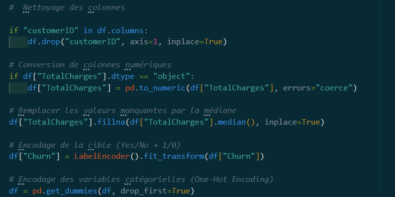
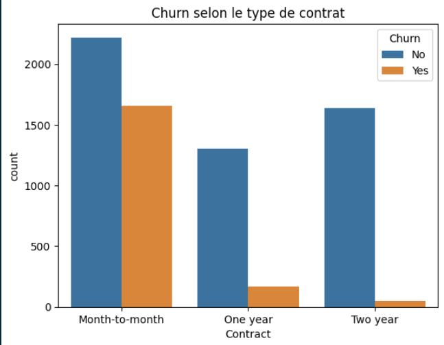
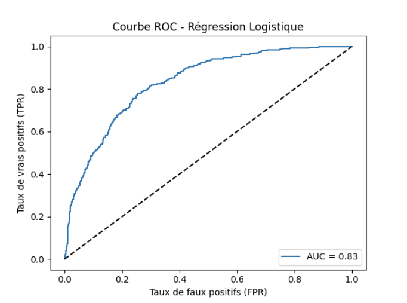

# Prédiction du Churn Client - Documentation du Projet

Ce projet vise à prédire le churn (départ client) dans le secteur des télécommunications à partir de données réelles. Voici les principales étapes qui m'ont permis de réaliser ce projet :

## 1. Collecte et Préparation des Données
- On commence par le chargement du dataset brut (CSV).
- On met en place un nettoyage des données : suppression des colonnes inutiles, conversion des colonnes numériques mal typées, gestion des valeurs manquantes.
- Encodage des variables catégorielles (Yes/No → 0/1).
- Création de variables synthétiques (ex : nombre de services souscrits).
- Normalisation des variables numériques.
### Extrait du code illustant ce qui a été fait 

## 2. Analyse Exploratoire (EDA)
- Visualisation de la répartition du churn et des variables clés (tenure, MonthlyCharges, TotalCharges, type de contrat, etc.)
- Analyse des profils de clients churnés selon plusieurs variable: selon Type de contrat, tenure.

#### Dans ce graphique on peut analyser que les clients optant pour un contrat plus court churn plus que les clients avec un long contrat.
- Repartition churn vs non churn (graphique).
- L'utilisation d'un Random Forest (exploratoire) à été nécéssaire afin d'identifier le Top 10 des variables les plus importantes:

#### Dans ce graphique on peut analyser  les différantes varaibles les plus influantes qui sont: TotalCharges,tenure, MonthlyCharges nous prédise  le plus de churn .

## 4. Entraînement des Modèles
### . Ensuite nous passons à l'entrainement de 3 différents modèle
- Régression Logistique : modèle de base pour la classification binaire.
- Arbre de Décision : modèle interprétable, visualisation des règles.
- Random Forest : ensemble d’arbres pour améliorer la robustesse et la précision.
#### . C'est 3 modèles nous donne une idée claire sur quelle modèle nous pouvons basée notre étude

## 5. Évaluation et Comparaison
- Sur les 3 modèles nous utilisons des  Matrices de confusion, rapports de classification (accuracy, recall, precision, F1-score) pour comparer quelle modèle est le choix le plus judicieux.
- Courbes ROC et calcul du score AUC.

####  Ci-dessus  la courbe ROC du modèle de régression logistique pour la prédiction du churn. Plus la courbe est proche du coin supérieur gauche, meilleur est le modèle.

## 6. Sélection et Sauvegarde du Modèle
- Comparaison des performances des modèles:
| Modèle                | Accuracy | Recall (Churn) | F1-score (Churn) | AUC      |
| --------------------- | -------- | -------------- | ---------------- | -------- |
| Régression Logistique | **0.79** | 0.51           | 0.56             | 0.83     |
| Arbre de Décision     | 0.75     | 0.55           | 0.57             | 0.80     |
| Random Forest         | **0.82** | **0.63**       | **0.68**         | **0.87** |
#### Ici on remarque dans ce tableau de comparaison des 3 différents modèle que le Random Forest est le plus robuste avec un meilleur Recall ainsi qu'un meilleur AUC.

## ! Malgré ces scores on remarque une limite importante des modèles pour détecter les client qui churn avec untaux assez faibles (voir matrice de confusion des 3 modèles)
- On mets en place une sauvegarde du modèle entraîné (fichier .pkl) pour une utilisation future.

## 7. Visualisation et Interprétation
- Dashboards et graphiques pour explorer les résultats et faciliter la prise de décision.

## 8. Conclusion & Recommandations
- Modèle retenu = Random Forest (meilleur compromis).
- Insights métier :
- Les contrats mensuels → plus de churn.
- Les clients récents (<12 mois) → plus de churn.
- Charges élevées → plus de churn.
- Recommandations : cibler ces profils pour les programmes de fidélisation.

---

**Structure du projet :**
- `scripts/` : scripts Python pour la préparation, l’entraînement et l’évaluation des modèles.
- `notebooks/` : notebooks pour l’analyse exploratoire et la visualisation.
- `data/` : fichiers de données.
- `models/` : modèles sauvegardés.
- `result/` : graphiques et résultats intermédiaires.

**Auteur :** Rody Guemegah

**Usage :**
- Exécutez les scripts dans l’ordre pour reproduire le workflow complet.
- Modifiez les paramètres des modèles pour optimiser la détection du churn selon vos besoins.
